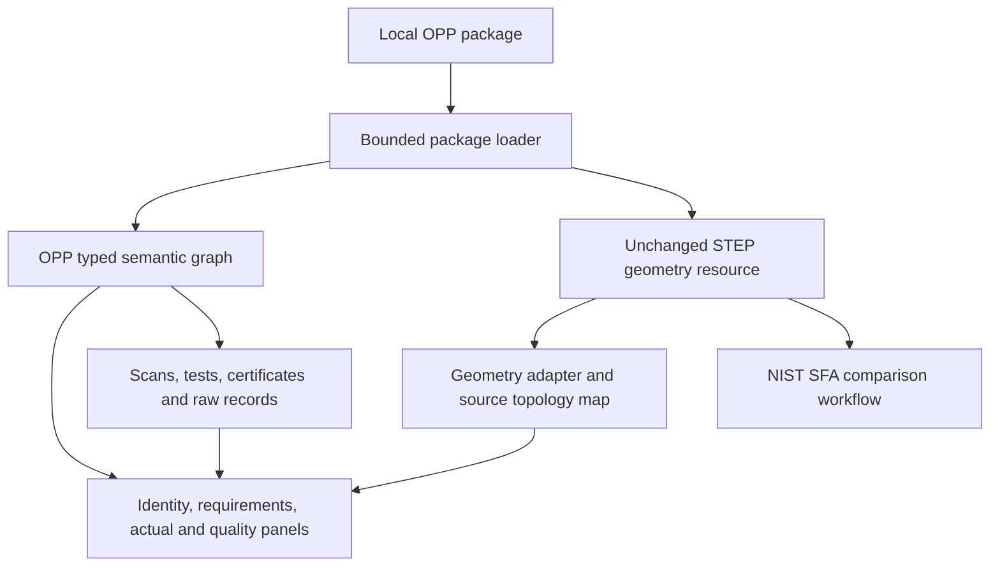

# First OPP viewer plan

The viewer should help an engineer understand a design and review a physical realization from one local file. It must display engineering support gaps clearly and preserve the original evidence.

## Minimum useful product

1. Open a local `.opp`, verify inventory, and show part/assembly identity and exact revision.
2. Browse the reusable assembly tree and select a specific occurrence path.
3. Select a feature/region and show its effective requirements, state and interpretation.
4. Select a characteristic and highlight its reliably mapped exact geometry.
5. Switch between design and actual views; choose a physical serial/lot, run, observation and equipment/calibration record.
6. Overlay actual scans using their declared registration. Label sparse scans and best-fit alignment clearly.
7. Show measured conformance separately from acceptance under a deviation; open raw evidence and FAIR accountability.
8. Surface unsupported profiles, unresolved notes, normative dependency gaps, conversion losses, and invalid bindings.

## Architecture

## SFA path

A fork can reuse analysis and presentation infrastructure after the [source/dependency assessment](nist-sfa.md). First prove exact region highlighting and an offline run before extending the whole viewer. Use SFA output as an independent comparison of retained source PMI, not a second authority competing with OPP requirements.

If dependency or platform constraints make a direct fork unsuitable, an OPP frontend can retain SFA as a comparison tool and use a replaceable STEP adapter. The semantic model and schema should not depend on a particular rendering engine.

## Public acceptance fixtures

Test a simple part, repeated/nested subassemblies, optional purchased interface geometry, two states, multiple faces per feature, post-coating dimensions, datum order/modifiers, a failed measurement accepted by concession, invalid calibration, actual scans with different units, and unsupported normative annotations.

The current repository implements the package model/checker and synthetic examples. It does not yet implement this interactive viewer or an SFA fork.

