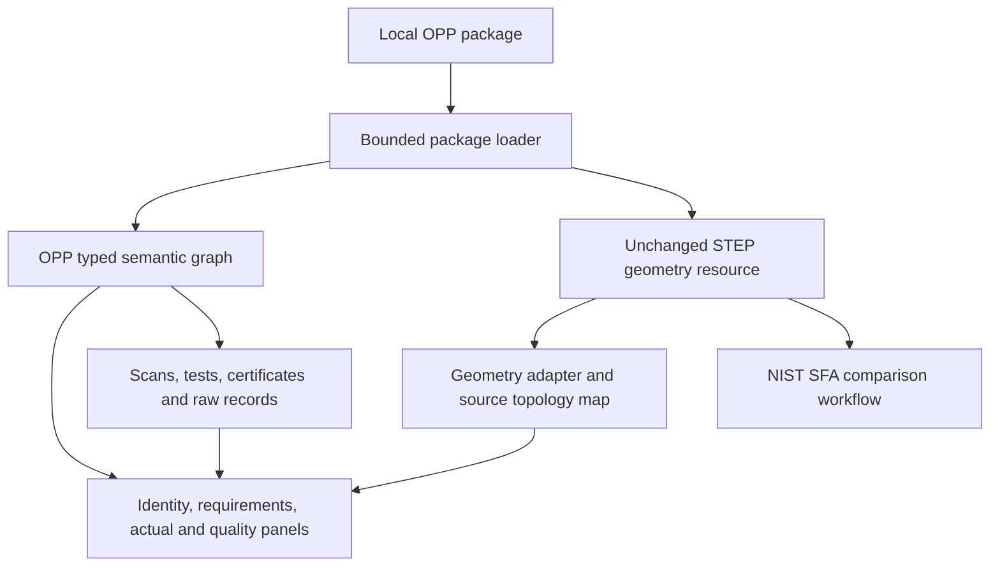

# OPP viewer implementation and next steps

The independent [OPP Viewer](https://github.com/Open-Part-Protocol/opp-viewer) is a native Rust application for Linux, Windows, and macOS. It helps an engineer understand a design and review a physical realization from one local file, with visible engineering support gaps and preserved original evidence.

The initial prototype embeds this repository's `0.1.0-draft.1` schemas. It implements package checks, nested product/occurrence browsing, experimental STEP previews, registered ASCII PLY overlays, and requirements/production/equipment/evidence views. Its [support matrix](https://github.com/Open-Part-Protocol/opp-viewer/blob/main/docs/support.md) distinguishes recorded data review from engineering interpretation.

## Target review capabilities

1. Open a local `.opp`, verify inventory, and show part/assembly identity and exact revision.
2. Browse the reusable assembly tree and select a specific occurrence path.
3. Select a feature/region and show its effective requirements, state and interpretation.
4. Select a characteristic and highlight its reliably mapped exact geometry.
5. Switch between design and actual views; choose a physical serial/lot, run, observation and equipment/calibration record.
6. Overlay actual scans using their declared registration. Label sparse scans and best-fit alignment clearly.
7. Show measured conformance separately from acceptance under a deviation; open raw evidence and FAIR accountability.
8. Surface unsupported profiles, unresolved notes, normative dependency gaps, conversion losses, and invalid bindings.

## Architecture

## Native implementation

The viewer uses `eframe`/`egui`, a bounded offline Rust package reader, bundled schemas, and a replaceable pure Rust STEP adapter using Truck. Product placement and physical identity are resolved through OPP occurrence paths. Measured conformance and acceptance under a deviation remain separate.

Exact face highlighting, comprehensive AP242 semantic conversion, and complete GD&T/FAIR certification are not implemented. Unsupported previews preserve metadata and report their limitations.

## SFA reference

The [source/dependency assessment](nist-sfa.md) remains useful for standards and migration comparisons. The unused fork is preserved in [opp-viewer-sfa-reference](https://github.com/Open-Part-Protocol/opp-viewer-sfa-reference). No SFA source or platform-specific runtime is included in the Rust viewer. Use SFA output as an independent comparison of retained source PMI. The semantic model and schema do not depend on a rendering engine.

## Public acceptance fixtures

Test a simple part, repeated/nested subassemblies, optional purchased interface geometry, two states, multiple faces per feature, post-coating dimensions, datum order/modifiers, a failed measurement accepted by concession, invalid calibration, actual scans with different units, and unsupported normative annotations.

This repository maintains the protocol model, checker, mappings, and synthetic fixtures. The interactive application and its platform builds live in the separate OPP Viewer repository. The list above includes capabilities still to be implemented; the viewer's published support matrix is the current implementation boundary.

