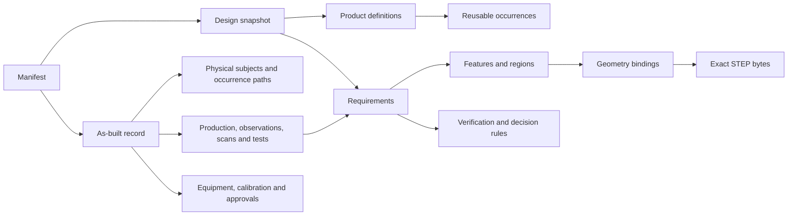

# V0 specification overview

Version: `0.1.0-draft.1`. Status: proposed working draft. All files in `schemas/v0/` belong to this exact version.

An OPP package exchanges an immutable snapshot. `packageType` selects **design** or **as-built**. A design may contain any number of reusable product definitions but resolves to one exact root. An as-built includes that design and its required resource closure, then records one or more physical subjects.

## Authority

| Domain | Authoritative representation |
| --- | --- |
| Nominal shape | Representations explicitly labeled `nominal-exact`, in their declared product state. |
| Product identity, assembly semantics, requirements, acceptance rules | `design/design.json`. |
| Physical identity, actual production records, reported observations and evaluations | `actual/as-built.json` and the exact evidence resources it references. |
| Visual presentation | Derived views; not independent engineering requirements. |
| Imported STEP PMI or legacy drawings | Preserved source unless translated into reviewed OPP requirements. |

Changing an authoritative payload creates a new snapshot and package ID. An as-built does not alter its design to accommodate an actual deviation. Multiple actual records may refer to the same design bytes. Retesting appends/replaces a record through explicit supersession; readers preserve the prior evidence.

## Model relationships

## Serialized documents

| File | Entry schema | Purpose |
| --- | --- | --- |
| `manifest.json` | `manifest.schema.json` | Package inventory, document resource IDs, format, profiles, and raw-byte hashes. |
| `design/design.json` | `design.schema.json` | Entire resolved design graph. |
| `design/bindings.json` | `bindings.schema.json` | Region → representation → exact geometry entity references. |
| `actual/as-built.json` | `as-built.schema.json` | Physical subjects and actual records; required only for as-built. |
| Optional presentation document | `presentation.schema.json` | Camera/view/characteristic selections and derived previews. |
| Optional conversion report | `conversion-report.schema.json` | Per-source-item preservation, loss, conflicts, and unsupported content. |

Paths other than `manifest.json` are declared by the inventory; the displayed paths are recommended conventions. All schema definitions are bundled in [the schema directory](../../../schemas/v0/README.md). Their URNs do not require network resolution.

Structural completeness of this draft's object graph does not mean all proposed requirement families have interoperable engineering semantics. [Profiles](profiles.md) and [conformance](conformance.md) identify what remains experimental.

